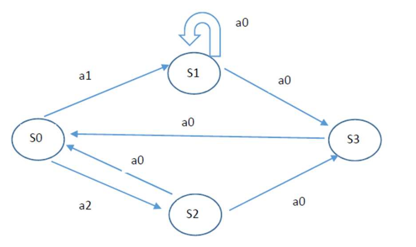
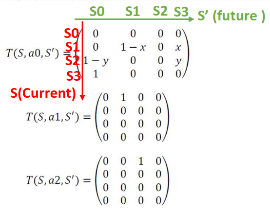
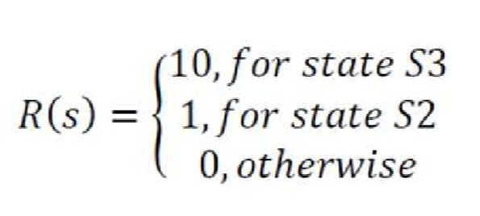

# TP5 - ROB311
[This TP](ROB311%20-%20RL.pdf) gives us a basic idea of how Reinforcement Learning principles work.

## Learning Case Scenario
To illustrate it, we'll be answering some questions based on this diagram of state transition and actions.



| Transition Probabilities | State Rewards |
| --- | --- |
|  |  |

## Synthetic Description

**States:** S0, S1, S2, S3

**Transitions:**
- S0 ==a1==> S1 (deterministic)
- S0 ==a2==> S2 (deterministic)
- S1 ==a0==> S1 (prob: 1-x) or S3 (prob: x)
- S2 ==a0==> S3 (prob: y) or S0 (prob: 1-y)
- S3 ==a0==> S0 (deterministic)

**Rewards:**
| State | Reward |
| --- | --- |
| S0 | 0 |
| S1 | 0 |
| S2 | 1 |
| S3 | 10 |

## Questions

### Question 1: Possible Policies

Enumerate all possible policies.

**Answer:** There are 2 possible policies since only S0 has multiple available actions (a1 or a2). All other states have only one action available (a0).

| Policy | S0 | S1 | S2 | S3 |
| --- | --- | --- | --- | --- |
| $\pi_1$ | a1 | a0 | a0 | a0 |
| $\pi_2$ | a2 | a0 | a0 | a0 |

### Question 2: Bellman Optimality Equations

The Bellman optimality equation is:

```math
\begin{aligned}
V^*(s) &= R(s) + \max_a \gamma \sum_{s'} T(s,a,s') V^*(s') \\
V^*(s_0) &= \gamma \max\{V^*(s_1), V^*(s_2)\} \\
V^*(s_1) &= \gamma [(1-x) V^*(s_1) + x V^*(s_3)] \\
V^*(s_2) &= 1 + \gamma [y V^*(s_3) + (1-y) V^*(s_0)] \\
V^*(s_3) &= 10 + \gamma V^*(s_0)
\end{aligned}
```

### Question 3: Optimal Policy for π*($S_0$) = $a_2$

Is there a value for x such that for all $\gamma$ ∈ [0,1) and y ∈ [0,1], $\pi$*($S_0$) = $a_2$?

When x = 0, state $S_1$ becomes a trap that gives no reward and never reaches the high-reward state $S_3$ (it always loops back to itself). Meanwhile, $S_2$ always gives an immediate reward of 1 and has potential to reach $S_3$. Therefore, V*($S_2$) > V*($S_1$) for all $\gamma$ and y, making $\pi$*($S_0$) = $a_2$ optimal.


### Question 4: Optimal Policy for π*(s0) = a1

### Question 5: Value Iteration Implementation
